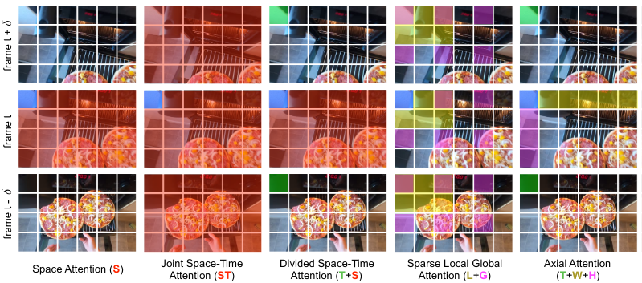
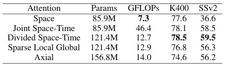

[Is Space-Time Attention All You Need for Video Understanding?](https://arxiv.org/pdf/2102.05095.pdf)
2021 - Gedas Bertasius, Heng Wang, Lorenzo Torresani

---

👁️

**Problem:**
A self-attention model for video understanding results in lots of query-key pairs if the attention is calculated across frames 

**Solution:**
Only pair each Query patch with the patch in the same position in the previous and following frames. 

**Architecture:**
Adapts the Transformer architecture to videos.
Same as in the Vision Transformer [Dosovitskiy et al. 2020](../dosovitskiy2020worth/summary.md), an image is split into 16x16 patches and flattened, each patch is the K,Q and V for the self-attention mechanism. These models are basically an extension of the Vision Transformer to videos. 
Investigates 5 different self-attention mechanisms over both the space and time dimensions. 

See image: blue is an example Query patch, the other colors show all Key patches for the Query patch in blue. 
- Space Attention: Query patch only attends to patches in the same frame
- Joint Space-Time Attention: Query patch attends to all patches in same frame and all patches in previous and in next sampled frames. 
- **Divided Space-Time Attention**: Query patch attends to all patches in the same frame and only to the patch in the same position (same location index) in the previous and next sampled frames
- Sparse Local Global Attention: Query patch attends separately to a local neighborood of patches, and to global patches across the whole frame with stride 2, and does this for the same frame and for previous/next sampled frames
- Axial Attention: in the same frame, Query patch attends separately to patches on the same horizontal and vertical axes. On previous and next sampled frames, the Query patch attends only to the patch on the same location (same location index)

All of the models learn difference Q/K/V matrices for each attention step (as indicated by having different colors for each patch in the image below)

**Results:**

Table shows parameter count for different models and results on 2 different sets

Claims SOTA on several action-recognition sets, plus faster training and testing. 
The Divided Space-Time Attention performs the best

**Notes:**

3D CNN for video classification are quite inefficient, so there's a clear use case for this, and there's a chance that self-attention will replace CNNs for 2D image classification as well. The paper doesn't show a comparison with a 3D CNN, so it's unclear

---

[BACK](../index.md)

[HOME](../../../index.md)