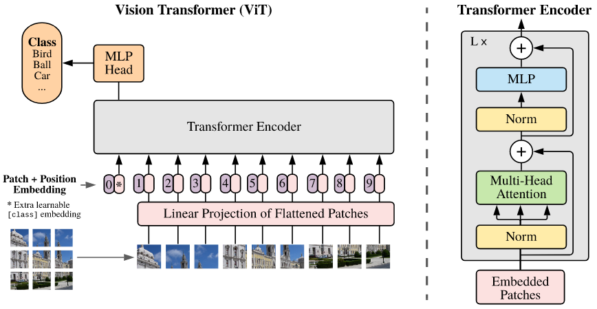

[An Image is Worth 16x16 Words: Transformers for Image Recognition at
  Scale](https://arxiv.org/pdf/2010.11929.pdf)
2020 - Alexey Dosovitskiy, Lucas Beyer, Alexander Kolesnikov, Dirk Weissenborn, Xiaohua Zhai, Thomas Unterthiner, Mostafa Dehghani, Matthias Minderer, Georg Heigold, Sylvain Gelly, Jakob Uszkoreit, Neil Houlsby

---

👁️

**Problem:**
Apply the Transformer architecture to Image classification

**Solution:**
Split the input image in 16x16 patches and add a positional encoding to each, then just feed to the Transformer.

**Architecture:**
Introduces the Vision Transformer (ViT) architecture. There's no change in architecture relative to the classic Transformer used in NLP. The only two additions are: 

- Use 16x16 flattened image patches as input, equivalent to single word embeddings vectors in NLP
- Add a positional embedding to each patch   

Flattened  image patches are linearly projected to a lower-dimensional embedding, and a positional embedding is added. 

Classification is returned as an extra classification token after and MLP head. 1

**Results:**

**Notes:**
Transformers work really well when training on very large sets (14M-300M images). For smaller sets, the inductive biases encoded in the Convolutional layers (equivariance, translational invariance) make training easier and yield better performance then Convolution-free self-attention architectures.
However one can pretrain on a large-scale image dataset, and then finetune for a specific task. This should give good performance on smaller datasets too.

---

[BACK](../index.md)

[HOME](../../../index.md)