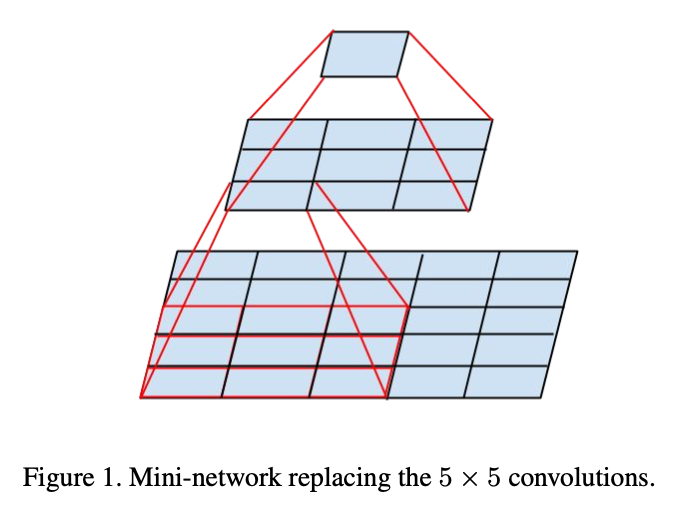
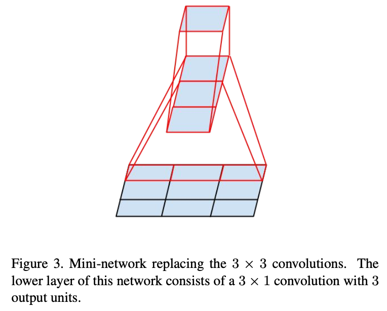
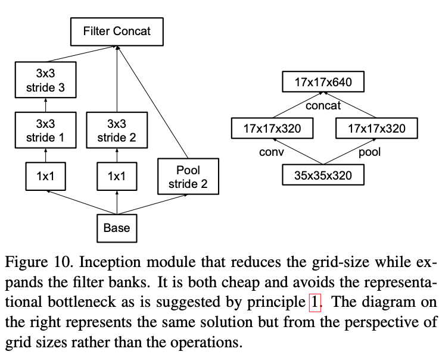

[Rethinking the Inception Architecture for Computer Vision](https://arxiv.org/pdf/1512.00567v1.pdf)
2015 - Christian Szegedy, Vincent Vanhoucke, Sergey Ioffe, Jonathon Shlens, Zbigniew Wojna

---

👁️👁️

This paper introduces the InceptionV3 architecture, based on an update Inception module. 

**Problem**

VGG has a simpler architecture than GoogLe Net, but is much more computationally complex. 
Scaling up GoogLe Net naively leads to a very large increase in the number of parameters.

**Solution**

Propose a few design principles to follow when scaling up the Inception model. 

- Avoid representation bottlenecks, especially early in the network: avoid bottlenecks with extreme compression, the amount of information should decrease progressively from the input to the output. Size of the representation is only an estimate of the information content, ignoring factors like correlation structure
- Higher dimensional representations are easier to process locally within a network (not sure what they mean by this one)
- Spatial aggregation can be done over lower dimensional embeddings without much or any loss in representational power (what do they mean? That you can run a 1x1 conv before a 3x3 and still expect good results? I think that they mean in general that we can factorize convolutions into sequences of smaller convolutions, without losing representational expressiveness)
- Balance the width (number of filters per stage) and depth of the network

These design principles are turned into design choices.

- We can replace 5x5 convolutions with two consecutive 3x3 convolutions, which reduces parameter count because weights are shared between tiles, reducing computation by 28%. One would think that it should have linear activations in the first layer, but they find empirically that ReLU works better, even in the first layer.
In general, convolutions larger than 5x5 can alway be reduced to sequences of 3x3 convolutions. 

- We can also replace 3x3 convolutions with a 3x1 followed by a 1x3, reducing computation by 33% for the same number of filters (we could also factorize it with two consecutive 2x2, but it would only reduce computation by 11%). In general, one can replace any NxN convolution with a 1xN followed by an Nx1, although it finds that it doesn't work well on early layers  

- Adding an auxiliary classifier does help achieve a higher accuracy, but only helps towards the end of training. The hypothesis is that it acts as a regularizer (they reject a previous hypothesis that it helped with vanishing gradients).

- To avoid representational bottlenecks coming from the pooling operation, they increase the number of filters by adding a stride 2 conv layer alongside the stride 2 pooling operation, and then concatenating the outputs along the filter dimension, resulting in 2x filters 
  

So the final revisited Inception module combines the factorisation of the 5x5 convolutional layers into two consecutive 3x3 conv and concatenates the output of another 3x3 conv to the output of the pooling operation to increase filter size. The 1x1 conv before each layer come from the original Inception module architecture.

Using these tricks they're able to train a 42-layers deep networks that is much more efficient than VGG and 2.5x more computationally intensive than GoogLe Net

- They also introduce **Label Smoothing**, a regularization technique to reduce the overfitting that might occur with binary labels and CE loss, because it encourages a large difference between the largest logit and the others. Replace the binary label with a mixture of the original label and an extra term sampled from another distribution (they suggest a uniform). So, replace label distribution $q(k|x)=\delta_{k,y}$ (where $\delta_{k,y}$ is Dirac's delta, equal to 1 for $k=y$ and 0 otherwise) with $q'(k|x)=(1-\epsilon)\delta{k,y}+\epsilon u(k)$ and they propose $u(k)=1/K$, where $K$ is the number of classes (for Imagenet, 1000).

They run a few experiments...

**Notes:**
Contains really good diagrams showing the changes from the original Inception module, which work well also as visualisations of complex conv operations (e.g. the diagrams showing how a 5x5 conv can be factorised into two 3x3, or a 3x3 into two asymmetric convs)

Really good discussion/presentation of label smoothing, and the issues with 0/1 labels and cross-entropy loss

---

[BACK](../index.md)

[HOME](../../../index.md)