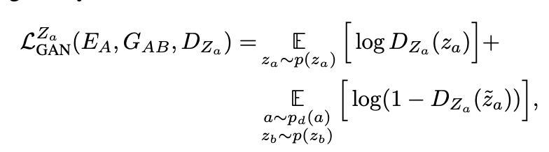

[Augmented CycleGAN: Learning Many-to-Many Mappings from Unpaired Data](https://arxiv.org/pdf/1802.10151.pdf)
2018 - Amjad Almahairi, Sai Rajeswar, Alessandro Sordoni, Philip Bachman, Aaron Courville

---

👁️ 

**Problem:**

CycleGAN translations are deterministic and one-to-one, but many translations are actually many-to-many. Adding stochastic latent vectors $z$ to the input would in principle allow a nondeterministic, many-to-many mapping: however the cycle-consistency loss encourages $G$ to ignore $z$, since there is an implicit unimodality assumption in the loss - any translated image $b$ must be able to transformed back into an image $a' \approx a$ in the reconstruction. It suggests replacing the L1 error with a variation bound on the log-likelihood. They present another method though.

**Solution:**

Augment the CycleGAN model with latent vectors $z_{a}$ and $z_{b}$, trained through two encoders that take original and translated image as input and output a prediction for the latent vectors. Use adversarial loss and cycle-consistency loss both for the translated images and latent vectors.

**Architecture:**

A model with four components: two generators and two encoders.
$$
G_{AB}:A\times Z_{b}\to B 
\\
G_{BA}:B\times Z_{a}\to A
\\
E_{A}: A\times B\to z_{a}
\\
E_{B}: A\times B\to z_{b}
$$
$p(z_{a})$ and $p(z_{b})$ are Gaussian priors over $Z_{a}$ and $Z_{b}$. From a pair $(a, z_{b})$, generate a pair $(\tilde{b}, \tilde{z}_{a})$:
$$
\tilde{b} = G_{AB}(a, z_{b})
\\
\tilde{z}_{a}=E_{A}(a,\tilde{b})
$$
similarly, from a pair  $(b, z_{a})$ generate  $(\tilde{a}, \tilde{z}_{b})$:
$$
\tilde{a} = G_{BA}(b, z_{a})
\\
\tilde{z}_{b}=E_{B}(b,\tilde{a})
$$

Losses for the cycle $A\to B$:

1. **Adversarial loss $L^{B}_{GAN}$**, compares real image vs generated image

2. **Marginal matching loss $L^{z_{a}}_{GAN}$**, an adversarial loss over the reconstruction $\tilde{z}_{a}$ of latent vector $z_{a}$

​	Note that $L^{B}_{GAN}$ and $L^{z_{a}}_{GAN}$ use two independent discriminators, $D_{b}$ and $D_{z_{a}}$ respectively 

3. A **cycle-consistency loss $L^{A}_{CYC}$**, for input image $a$ vs reconstructred image $a'$

   

4. A **cycle-consistency loss $L^{z_{b}}_{CYC}$** for reconstructing latent vector $z_{b}$

   

   

**Analogous losses are defined for the cycle $B\times Z_{a}\to A\times Z_{b}$, and the model is trained on both objectives at the same time*

**Results:**

Skimmed paper, didn't read

**Notes:**

An issue on the github repo flags that they use one deterministic latent vector, instead of having both of them as stochastic as stated in the paper, and wonders whether the code in the repo is the one actually used for the paper.

---

[BACK](../index.md)

[HOME](../../../index.md)