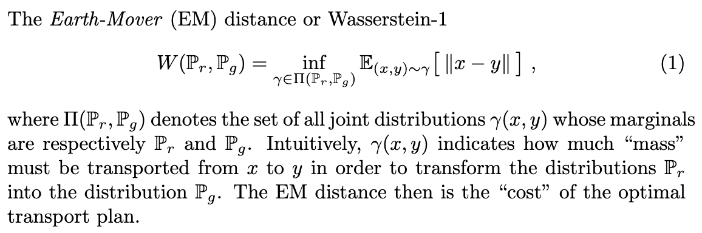

[Arjovsky, M., Chintala, S. and Bottou, L., 2017. Wasserstein gan. arXiv preprint arXiv:1701.07875.](https://arxiv.org/pdf/1701.07875.pdf)

---

👁️ (skimmed paper, skimmed [summary article](https://lilianweng.github.io/lil-log/2017/08/20/from-GAN-to-WGAN.html))

The introduction has a good discussion of generative models in general. 
There's an interesting observation on why we need to add noise to these models, which I don't fully understand.
Also, a discussion  of the advantages of VAE and GANs over other types of generative models: instead of learning a density directly, they learn a parameterised function mapping from a noise vector to the target distribution.

- Learning a high-dimensional density directly fails to represent distributions that are constrained to a lower-dimensional manifold: using a low-dimensional input noise vector constrains the learned distribution to lie on a lower-dimensional manifold (the constrain is given by the lower dimensionality of the noise vector)
- Generating samples from an arbitary high-dimensional density is computationally difficult. Mapping a noise vector to a datapoint through a learned function will not give the correct numerical value of the density, but this is generally less important than generating samples, which can be done efficiently with the noise vector approach. 

**Problem:**

GAN training is very unstable and difficult. There are several references to a theoretical investigation by the same authors of why it is so [(Arjovsky and Bottou 2017)](../arjovsky_and_bottou_2017/summary.md)

**Solution:**

Propose a new distance measure between the generative distribution and the target (real data) distribution, the Wassertein's distance, an approximation of the Earth Mover distance.

Earth Mover distance: 

**Results:**

A theoretical analysis of the Earth Mover (EM) distance

Empirical results on training GANs with Wassertein's distance:

- doesn't require balance in training between generator and discriminator
- doesn't require careful design of network architecture
- reduces mode collapse
- gives the ability to estimate EM distance by training the discriminator; EM distance correlates with observed sample quality

**Architecture:**

---

[BACK](../index.md)

[HOME](../../../index.md)