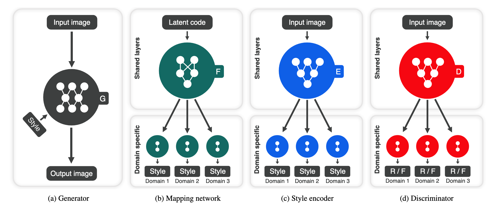
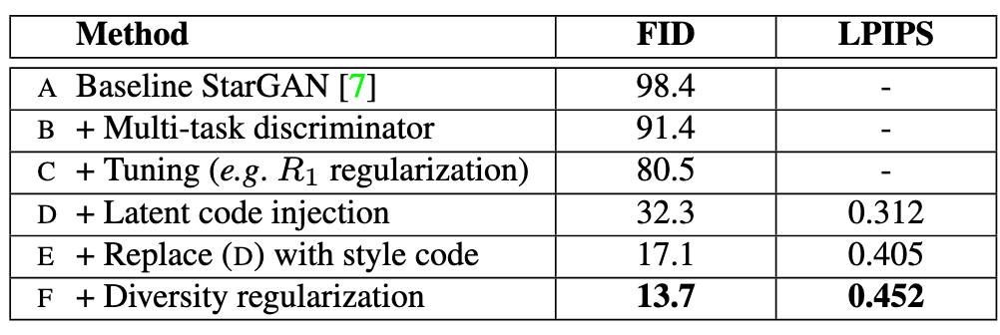
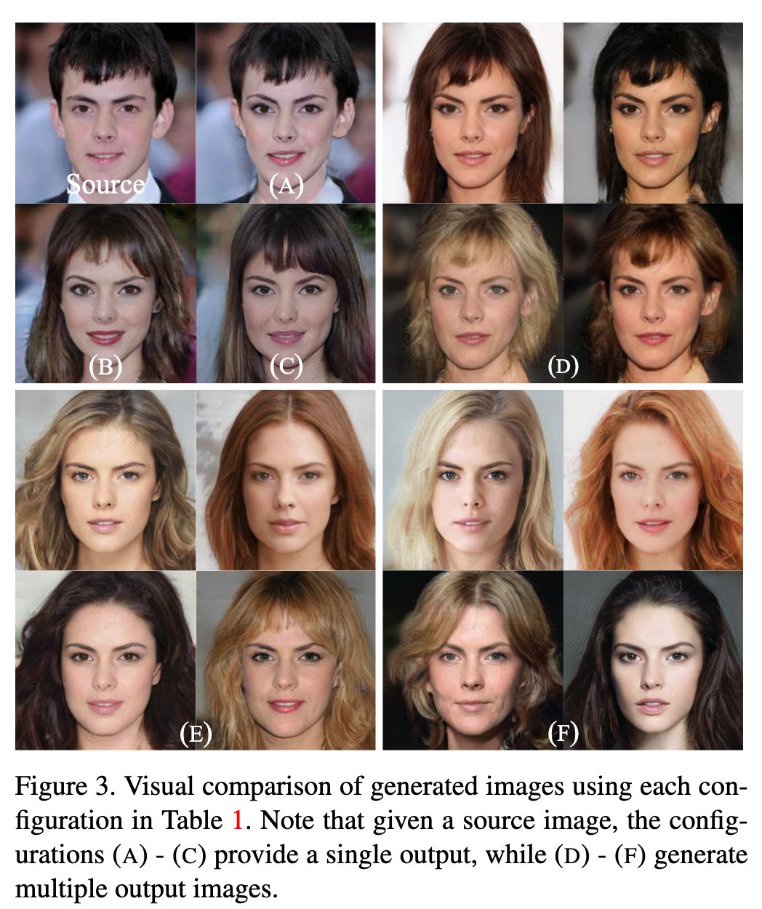

[StarGAN v2: Diverse Image Synthesis for Multiple Domains](https://arxiv.org/pdf/1912.01865.pdf)
2020 - Yunjey Choi, Youngjung Uh, Jaejun Yoo, Jung-Woo Ha

---

👁️👁️

**Problem:**

Increase *style diversity* of generated images in ITI, i.e. *generate diverse images in multiple domains*. ITI translation methods that increase *style* *diversity* rely on multiple generators, requiring $k(k-1)$ generators to translate between $k$ domains. StarGAN only requires 1 generator, but learns a deterministic mapping between images, which doesn't capture the multi-modal nature of the data distribution.

**Solution:**

Replace the target domain label concatenated to the input image in StarGAN with a stochastic label that can represent multiple styles for a given domain.

**Architecture:**

Introduce a mapping network and a style encoder. The style vector $s$ is fed to generator $G$ through Adaptive Instance Normalization.

- *Mapping network*: $s=F_{y}(z)$ goes from a latent vector $z$ to a style code $s$ corresponding to domain $y$. It's an MLP with one output branch per domain.

- *Style encoder*: s= takes as input an image $x$ and generates a style vector $s$ 

Uses a Multi-task discriminator, with each output branch $D_{y}$ each doing binary classification on whether image $x$ is a real image of domain $y$ or a fake image $G(x,s)$.

Introduce two new loss components:

- *Style reconstruction loss* - to force $G$ to use style $s$: 
  $$
  $L_{sty}=\mathbb{E}_{x,y,z}[||s-E_{y}(G(x,s))||_{1}]$ 
  $$
  

  where $E_{y}$ is the style encoder $E_{y}(x)$ that takes as input an image $x$ and returns a style code $s$. So, get code $s=E_{y}(x)$ from encoder $E$ and image $x$, then use that to generate image $G(x,s)$ and generate a new style code from the generated image, $E_{y}(G(x,s))$. Enforce that this code is close the original style code $s$. 

- *Style diversification loss* - to enforce diversity in generated images: 
  $$
  L_{ds}=\mathbb{E}_{x,y,z_{1},z_{2}}[||G(x,s_{1})-G(x,s_{2}))||_{1}]
  $$
  where $Z_{1,2}$ are random latent codes coming from mapping network $F$

Also uses *Cycle consistency loss*: when translating back to original image $x$ with domain $y$, use style code $\hat{s}=E_{y}(x)$, estimated from $x$ using Style Encoder $E$ 

$G$, $F$, $E$ and $D$ use the same objective:
$$
\min_{G,F,E} \max_{D} L_{adv} + \lambda_{sty}L_{sty} + \lambda_{ds}L_{ds} + \lambda_{cyc}L_{cyc}
$$
$G$ is a WGAN-GP like in StarganV1, but the ACGAN discriminator is replaced with a multi-task discriminator. It also applies R1 regularization and replaces depthwise concatenations with AdaIN.

**Results:**

Interesting ablation study, where it starts from the original Stargan and progressively add each of the proposed architectural improvements. 

Note the big improvement in FID scores with each addition. 

They show big improvements in generated images with each addition. Note that StarganV1 only adds make up to the image but doesn't have much variety in the generated image, 

It mentions that they tried to inject the latent code $z$ directly into $G$ and imposing a latent reconstruction loss $||z-E(G(x,z,y))||_{1}$, but it didn't work, they had to transform the latent vector into domain-specific latent codes through a learned network.

There's further experiments and comparisons but I didn't read them through for lack of time, I need to come back to them at a later point. 

**Notes:**

What constitutes style vs identity in medical images? Is it desirable to have variety in generated counterfactual images?

---

[BACK](../index.md)

[HOME](../../../index.md)