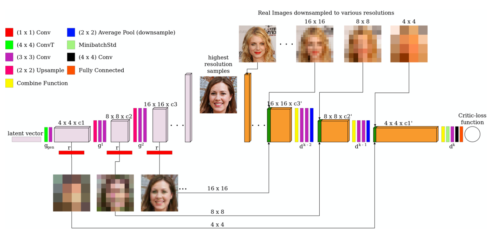

[Karnewar, A. and Wang, O., 2020. Msg-gan: Multi-scale gradients for generative adversarial networks. In Proceedings of the IEEE/CVF Conference on Computer Vision and Pattern Recognition (pp. 7799-7808).](http://openaccess.thecvf.com/content_CVPR_2020/papers/Karnewar_MSG-GAN_Multi-Scale_Gradients_for_Generative_Adversarial_Networks_CVPR_2020_paper.pdf)

---

👁️👁️👁️

**Problem:**
One of the reasons for GAN training instability is the presence of uninformative gradients when the support of the distribution of the generator and the training distribution have small overlap. One family of solutions is to add noise to both real and fake images, so as to increase the overlap in the support. Another approach is that of ProGAN, where a DCGAN is progressively enlarged, and previously trained layers are gradually unfrozen so as to retain the information learned at lower resolutions. This works well in practice, but has the disadvantage of complicating the training and introducing an additional hyperparameter (the rate at which the old layers are phased in).

**Solution:**
G has a classic upsampling architecture, from latent vector to high resolution image. D has access to images at various resolutions that are extracted from the feature maps of the intermediate layers of G. This gives G access to gradients from D for all resolutions, like in ProGAN.  

**Architecture:**
G is composed of upsampling blocks, each doubling the resolution of the image, starting from random normal input vector Z. Each upsampling block is composed of an upsampling operation followed by two conv layers. Resolution doubles with each block from 4x4 to the final output resolution. Each layer is also connected to a 1x1 conv layer, which converts the activations for the layer to image at the given resolution.This is a form of regularization, forcing the feature maps of G to be able to projected directly to image space, like in ProGAN. 

D is a normal conv network, but the images $o$ projected from the intermediate layers of G are combined to the feature maps of the corresponding layer in D. The first layer of D takes as input the highest resolution real or fake image. The outputs images projected from the intermediate layer i of G are concatenated to the activation maps of layer $i-1$ of D. So the feature map at layer $j$ of D is $a'_{j}=d_{j}(\phi(o_{k-j}, a'_{j-1}))$, where $o_{k-j}$ is the projected feature map of layer $i=k-j$ of G, and $\phi$ is a function used to combine the two. They experiment with three different $\phi$:

$$
\phi_{simple}(x_{1}, x_{2}) = [x_{1}; x_{2}] \\
\phi_{lin\_cat}(x_{1}, x_{2}) = [r'(x_{1}); x_{2}] \\
\phi_{cat\_lin}(x_{1}, x_{2}) = r'([x_{1}; x_{2}]) \\
$$

where $;$ is channelwise concatenation, and $r'$ is a projection through a $1x1$ convolution.

This architecture can be used with any loss function. They experiment with both WGAN-GP and Non-saturating GAN loss with 1-sided GP.
Since D is now a function of multiple images, the gradient penalty is modified to be the average of the penalties over each input. 

The experiments run use a 512 dim latent vector, drawn from a standard normal with hypersphere normalisation (see the ProGAN paper for details). Optimiser is RMSProp for both G and D. Also adds a modification of the MiniBatchStdDev technique (see ProGAN paper), where D has access to the value of the batch standard deviation of the activations of G in order to improve sample diversity. A MiniBatchStdDev layer is added at the beginning of each block in D. This should make mode collapse less likely.

**Results:**

Evaluates on 6 datasets, including a newly collected Indian Faces dataset. The MSG-GAN modification is added to a ProGAN architecture without the actual layer growing procedure (so basically a DCGAN) and to a StyleGAN architecture, and it's compared against StyleGAN and ProGAN without the modification. Training of MSG-GAN is slower per iteration, but tends to converge in fewer iterations than other models. 

Both MSG-GANs achieve better FID score than the respective baseline on 256x256 datasets. For high-res images, the MSG-ProGAN gets comparable scores and training speed for CelebA-HQ and FFHQ datasets, while MSG-StyleGAN gets lower FID scores than the non-MSG variant.

Shows that MSG-GAN has higher training stability, as measured by the MSE between generated samples for the same latent vectors across training epochs. ProGAN tends towards convergence (i.e. fewer changes in the generated image as training progresses) only for lower resolution images, while MSG-ProGAN seems to tend towards convergence at all resolutions (although visually the MSE seems to have more variance for some of the resolutions)

MSG-GAN training seems robust to changes in learning rate: it trains MSG-ProGAN with 4 different learning rates, and they all converge. 

Different combine functions perform better for different models: MSG-ProGAN performs best with the $\phi_{simple}$ function while MSG-StyleGAN did best with $\phi_{cat\_lin}$ 

**Notes:**

Really good paper, a simple approach to increase training stability, promising similar or better results than ProGAN with a much simpler implementation.

The choice of combine function $\phi$ affects the results. As suggested in the paper, it might be possible to improve the results by using a more advanced combine function (e.g. multi-layer densenet of AdaIN)

---

[BACK](../index.md)

[HOME](../../../index.md)
