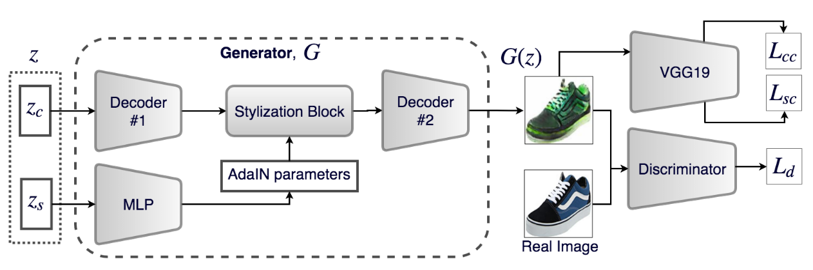

[Style and Content Disentanglement in Generative Adversarial Networks](https://arxiv.org/pdf/1811.05621v1.pdf)
2018 - Hadi Kazemi, Seyed Mehdi Iranmanesh, Nasser M. Nasrabadi

---

👁️

**Problem:**
Disentangling style and content in GANs, so that we can modify one independent of the other

**Solution:**
Propose the Style and Content Disentangled GAN (SC-GAN)
Instead of a single latent vector, uses one latent vector for style and one for content. 
Use AdaIN layers to inject style into the Generator. Parameters for AdaIN are generated by an MLP. 

**Architecture:**
The generator is composed of two decoders and one Stylization block. 

The first decoder is composed of upsampling and convolutional layers, with Instance Normalisation: this first decoder upscales the latent content vector into larger feature maps.  

Next, the Stylization block adds the style to the image. It's composed of residuals blocks with AdaIN, where the style code from the latent style vector is injected after being projected through an MLP. 

The second decoder upsamples the resulting feature maps to a full image via upsampling layers and convolutions (it doesn't have IN, so they apply BN to it).

For training, it samples 2 content codes and 2 style codes and uses for:
- *Content Consistency loss*: L2 norm between the Nth layer feature maps of a pretrained VGG19 for images generated by the two content codes
- *Style Consistency loss*: Style reconstruction loss from Gatys et al. (squared Frobenius norm between the Gram matrices of the feature maps of a VGG19) between two images generated from the two sampled style vectors. Sum this over several layers. 
- *Diversity loss*: to enforce diversity, add a loss term corresponding to the difference between the value of the Style Consistency loss and a positive margin. Add a similar term also for Content Consistency loss

**Results:**

**Notes:**

---

[BACK](../index.md)

[HOME](../../../index.md)