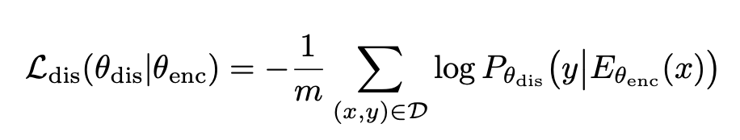
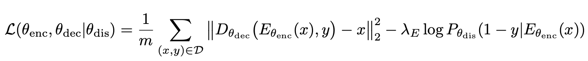

[Fader Networks: Manipulating Images by Sliding Attributes](https://arxiv.org/pdf/1706.00409v2.pdf)
2018 - Guillaume Lample, Neil Zeghidour, Nicolas Usunier, Antoine Bordes, Ludovic Denoyer, Marc'Aurelio Ranzato

---

👁️

**Problem:**

Manipulate unpaired images by modifying attributes with a slider: even if attributes are binary at training time, we want to modify them continuously at test time

**Solution:**

The proposed solution is different from previous methods because:

1. adversarial learning is used in latent space rather than pixel space
2. through adversarial learning, invariance to attributes is enforced in the latent space

The distribution of latent vectors over images is constrained to be the same across attribute values. A given latent vector should encode the structure of the image independent of the attributes: a classifier shouldn't be able to classify an image attributes by looking only at its latent representation. In this sense, the latent space should be *invariant* to attributes.

**Architecture:**

Combines an autoencoder with a discriminator, learn a latent space where classes are not disjoint so as to force the decoder to use the provided attributes. The encoder $E(x)$ is a CNN, decoder $D(E(x), y)$ is a deconvolutional net, the whole autoencoder is trained with MSE loss (they mention that better criteria could be used, e.g. PatchGAN). $D(E(x), y)$ alone learns to ignore the attribute vector $y$, so a further constraint on the latent space needs to be enforced. This is added through a discriminator trained with loss $L_{dis}$:  

where $P_{\theta_{dis}}(y|E_{\theta_{enc}}(x))$ is the output of the discriminator, which is a classifier over attributes $y$ that takes as input the latent vector $z=E_{\theta_{enc}}(x)$. The complete loss is then:

**Results:**

**Notes:**

---

[BACK](../index.md)

[HOME](../../../index.md)