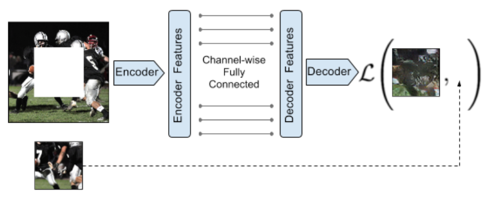
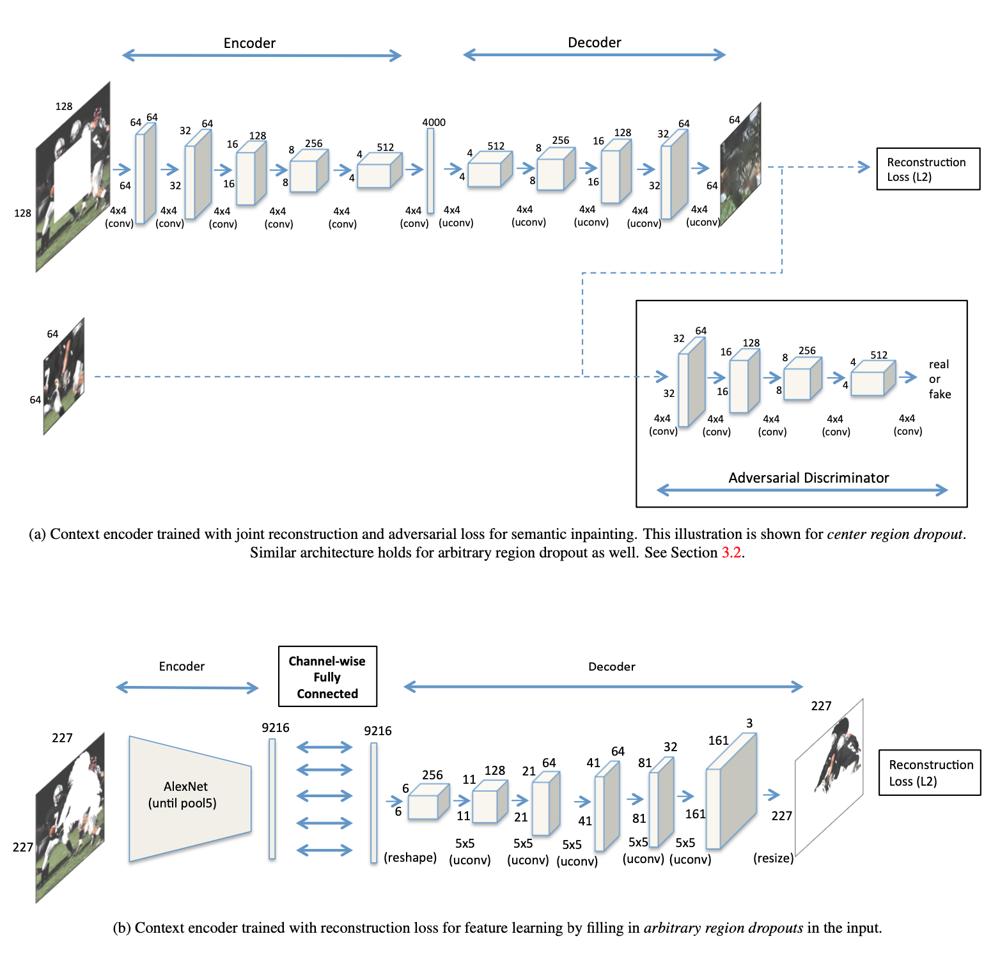

[Context Encoders: Feature Learning by Inpainting](https://arxiv.org/pdf/1604.07379.pdf)
2016 - Deepak Pathak, Philipp Krahenbuhl, Jeff Donahue, Trevor Darrell, Alexei A. Efros

---

👁️👁️

**Problem:**
Inpainting an arbitrary region in the original image

**Solution:**
An encoder-decoder generator with channelwise fully connected layers and a joint L2 + adversarial loss 

**Architecture:**
Alexnet-inspired encoder-decoder architecture. 
The encoder uses the layer up to pool5 of an Alexnet, then a channelwise fully connected layer, since conv layers these don't have connections between different parts of the image on the same channel (weights only combine different channels, not different regions of the same channel).

To limit parameter count, it restricts the fully connected layer to only connect nodes within a single channel, but not across channels. The channelwise FC layer is followed by a stride 1 conv layer to combine the channels/feature maps.
The latent vector between Encoder and Decoder is $6x6x256=9216$.
The decoder has five up-conv layers with Relu.

Loss includes both the L2 norm between the generated inpainting and the original masked region, and the adversarial loss. $\lambda_{rec}=0.999;\lambda_{adv}=0.001$. LR for context encoder is 10 times higher than for Discriminator. It predicts a larger patch that overlaps with the context over 7px, and it gives 10x weight for the reconstruction loss in this overlapping region, to ensure that the generated image is consistent with the context at the edge.

Only the Generator is conditioned on the image context not to simplify the task of the Discriminator, as it argues that the Discriminator is able to exploit the discrepancy between the generated inpainting and the context to make the classification easier.
Also, G is not conditioned on a noise vector (it improves the result). 

Appendix: results are worse if trained on 227x227 images directly, so it resizes to 128x128. Batch norm used both in the decoder and in discriminator, relu in decoder and leaky relu in encoder and discriminator.
In the case of arbitrary region inpainting the discriminator compares the whole generated image with the whole original image.

It seems like there's 2 separate architectures, one for the center region inpainting, with 4000 nodes in the bottleneck (and, it seems from the diagram, no channel-wise fully connected layer?), and one for arbitrary region inpainting, with the channelwise fc layer... I couldn't understand from the paper which architectures they were referring to at each point, and if they are indeed using two architectures, or if one is only for comparison.

**Results:**
Experiments on Paris StreetView and ImageNet, ablation study and comparison with NN inpainting. Also, some comparison with some layers being pretrained. 
It notes that L2 norm alone tends to inpaint a blurry average image, while the adversarial loss alone tends to generate a sharper inpainting that are not coherent with the context. Combining them gives SOA (at the time) results. 

Masking always done in the center of the image leads to learning worse features than masking random squared regions in the image and than masking arbitrary shaped regions in the image.

It mentions that they experimented with replacing pooling layers with convolutions, as pooling provides spatial invariance in classification, but in reconstruction-based tasks spatial invariance may be detrimental. However it seems like they kept the pooling layer for consistency with Alexnet.

It says that the adversarial loss didn't converge on the Alexnet inspired architecture, so they only used the L2 loss... it's unclear what architecture they're referring to...

**Notes:**
A nice intuition on L2 norm generating a blurry average image because that's what maximises the L2 norm, and the adversarial loss picking one mode from the distribution, hence sharper images.

Still unclear from the paper which is the architecture they actually used out of the two they present. 

---

[BACK](../index.md)

[HOME](../../../index.md)