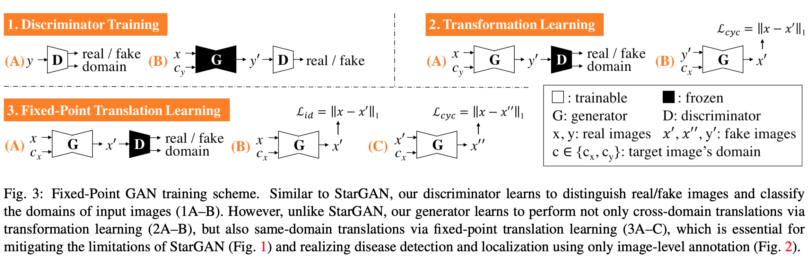
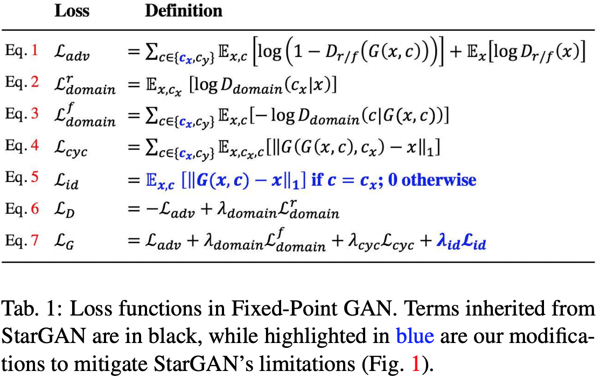
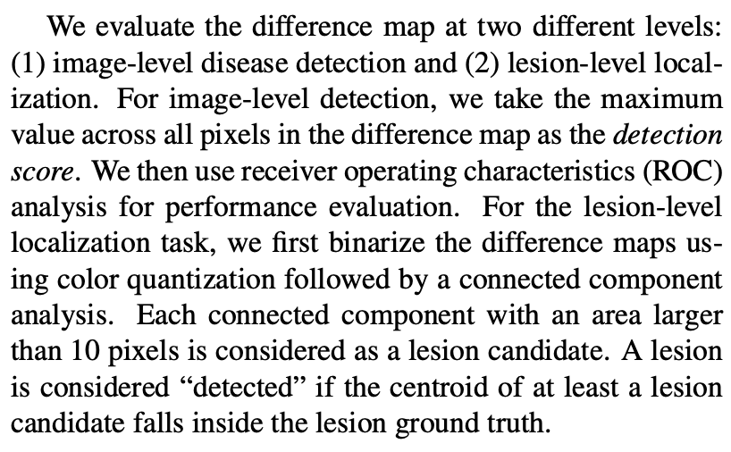

[Siddiquee, Md Mahfuzur Rahman, Zongwei Zhou, Nima Tajbakhsh, Ruibin Feng, Michael B. Gotway, Yoshua Bengio, and Jianming Liang. "Learning fixed points in generative adversarial networks: From image-to-image translation to disease detection and localization." In Proceedings of the IEEE International Conference on Computer Vision, pp. 191-200. 2019.](https://arxiv.org/pdf/1908.06965.pdf)

---

👁️👁️👁️

[Official implementation](https://github.com/mahfuzmohammad/Fixed-Point-GAN)

**Problem:**

Identify a single GAN architecture to remove objects from an image. Requirements:

1) Training with unpaired images
2) No source domain label required (e.g. no pathology label needed for healthification)
3) Learns identity mapping for same-domain translation (e.g. healthy images are kept intact)
4) **Learned cross-domain translation must be minimal** (e.g. healthification only removes the pathology, nothing else is changed in the source image)

**Solution:**

Introduce the concept of **Fixed point translation**. In maths,  x is a fixed point of function f(·) if f(x) = x. Fixed points in the learned translation are then pixels that are not changed during the translation from one domain to the other (e.g. from diseased image to healthy image, or from face with sunglasses to same face without sunglasses).

Unlike [Schlegl et al. 2019 f-AnoGAN](https://github.com/tSchlegl/f-AnoGAN), this method can use source image labels during training, thus learning to reconstruct by anomaly, instead of grouping all anomalies into the same residual category, thus giving both localization and classification of anomalies.

**Architecture:**

Architecture is similar to [StarGAN](../choi_et_al_2018/summary.md): 

1) updates the domain classification loss and the cycle-consistency loss to include same-domain translations
2) has an additional identity loss to explicitly learn the identity mapping when the domain of the input image is the same as the target domain.
3) regularizes the generator to find a minimal domain translation function

In the image: $c_{x}$ is the domain of input image $x$, $c_{y}$ is the target domain of target image $y$

Losses: 

1) **Adversarial Loss**: ensures that generated images are realistic. Same as in StarGAN, but revised to include also images from the same domain as the target domain, so e.g. both healthy and unhealthy images
2) **Domain Classification Loss**: ensures that generated images are from the correct domain. Same as in StarGAN, but also including images from the same domain as target domain. Note the difference between the discriminator domain classification loss $L_{domain}^r$, which doesn't include same-domain transformations and is identical to that of StarGAN, and the generator's one $L_{domain}^f$, which includes both same-domain and cross-domain transformations.
3) **Cycle Consistency Loss**: ensures that the learned transformation preserves enough information to translate the image back to the input domain. Same as in StarGAN, but including images where the domain is the same as the target domain
4) **Conditional Identity Loss**: new, not present in StarGAN. Penalizes the generator proportionally to the difference between the generated image and the input image when the source domain is the same as the target domain (same-domain transformation); when the two domains are different, that is, when the transformation is cross-domain, it does nothing. This ensures that :
   1) the generator learns the identity transformation for same-domain translation
   2) the transformation learned by the generator is forced to be minimal 

The final losses are the combined losses, shown in Eq. 6 and 7 in Tab.1

- The combined discriminator loss includes the adversarial loss and the discriminator domain classification loss
- The combined generator loss includes the adversarial loss, the generator domain classification loss, the cycle consistency loss and the new conditional identity loss

**Results:**

Trained the model on CelebA dataset 
- Better quality for generated images relative to StarGAN
- Significantly lower same-domain translation error relative to StarGAN (lower bound of the error is achieved by an autoencoder with the same architecture as the generators)
- Only changes image content that is required for domain translation, leaving the rest of the image content intact

Also trained on BRATS2013, a brain lesion dataset. They perform weakly supervised (requiring only image-level annotations) anomaly detection and localisation, like [Schlegl et al. 2019 f-AnoGAN](https://github.com/tSchlegl/f-AnoGAN)
- Only translates diseased to healthy and healthy to healthy, but doesn't separate by disease class: all diseases are translated to healthy, and then anomaly is detected as subtracting healthy image from test (healthy or diseased) image, generating a *difference map*. 
  - a potential entrypoint for additional research: divide input data by disease class: the trained generator is then able to transform any image from healthy to any other disease class -> counterfactual explanation: how would this image look like if it had disease x? 
  - then use Bau et al's GAN Dissection approach to identify neurons in the generator that are responsible for covering different diseases

Disease/anomaly detection:

- They compare the results with a few models, including StarGAN and [f-AnoGAN](https://github.com/tSchlegl/f-AnoGAN). Interestingly, for f-AnoGAN they use average activation of difference maps as detection score instead of the one proposed in the original implementation, as they find it more effective than the original anomaly score.
- Substantially outperforms StarGAN, f-AnoGAN and [Alex et al. 2017](https://ui.adsabs.harvard.edu/abs/2017SPIE10133E..0GA/abstract) (the last two are state of the art in weakly supervised/unsupervised anomaly detection)

- They also evaluate the anomaly detection on a third dataset, on Pulmonary Embolism
- For this dataset, they only compare it with non GAN methods, since the GAN-based one performed really bad: f-AnoGAN didn't converge and Alex et al. 2017 had poor localization and detection performance

They note that neither StarGAN nor Fixed-point GAN manage to remove large object from the image completely:
    - not so important for lesion detection and localisation, but it limits precise lesion-level segmentation 
    - they mention that this is the focus of their future research
    - another potential entrypoint for our own research

---

[BACK](../index.md)

[HOME](../../../index.md)