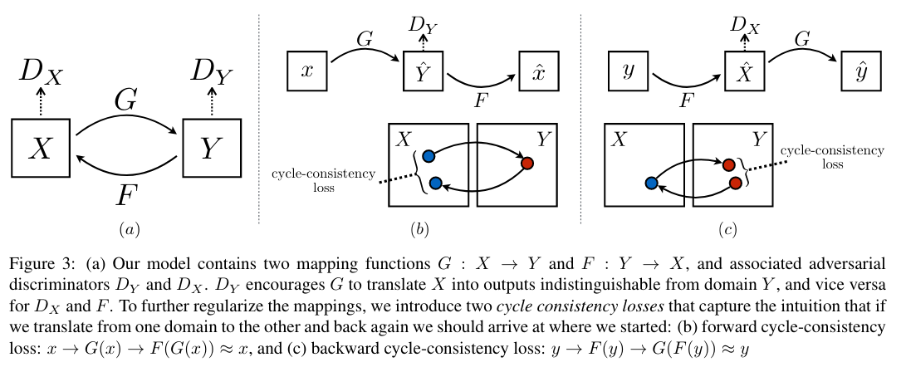

[Unpaired Image-to-Image Translation using Cycle-Consistent Adversarial
Networks](https://arxiv.org/pdf/1703.10593.pdf)
2020 - Jun-Yan Zhu, Taesung Park, Phillip Isola, Alexei A. Efros

---

👁️

**Problem:**

Existing ITI translation methods require paired images

**Solution:**

Introduce a cycle-consistency loss term that allows training without paired images, by minimising the reconstruction error from the output image to the input image. Since the translation $G: X \rightarrow Y$ is underconstrained (i.e. there are infinitely many mappings $G$ that will induce a transformation $X \rightarrow Y$ ), it adds a constraint on the inverse transform $F: Y \rightarrow X$ such that $F(G(X)) \approx X$ and $G(F(Y) \approx Y$. The Cycle-consistency loss, first introduced here, enforces this constraint.

**Architecture:**

Total loss includes both adversarial loss and cycle-consistency loss

**Results:**

**Notes:**

It describes

---

[BACK](../index.md)

[HOME](../../../index.md)
