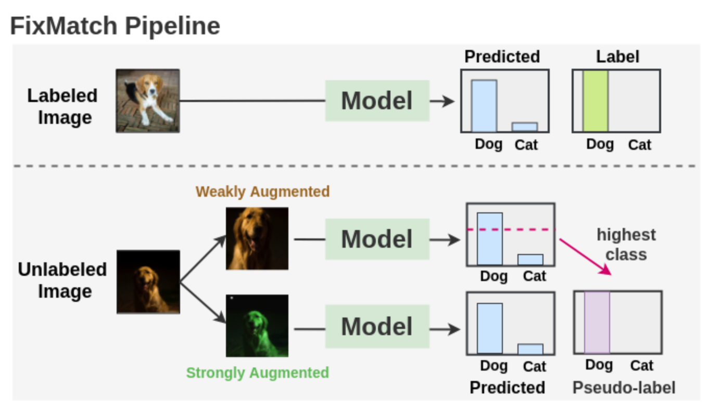
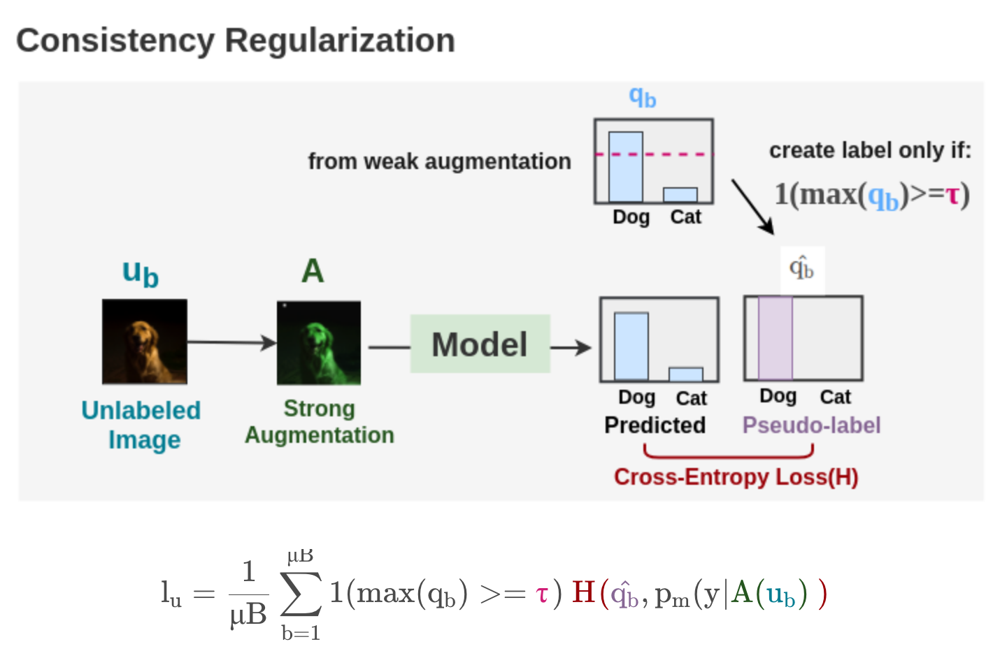

[Sohn, K., Berthelot, D., Li, C.L., Zhang, Z., Carlini, N., Cubuk, E.D., Kurakin, A., Zhang, H. and Raffel, C., 2020. Fixmatch: Simplifying semi-supervised learning with consistency and confidence. arXiv preprint arXiv:2001.07685.](https://arxiv.org/pdf/2001.07685.pdf)

---
👁️(skimmed, read [summary article](https://amitness.com/2020/03/fixmatch-semi-supervised/))

**Problem:**

Data scarcity

**Solution:**

Propose a mechanism for labelling unlabelled data based on datapoint augmentation. Given an unlabelled image, generate two images by weakly augmenting and strongly augmenting the other one, and use the supervised classifier to generate a class prediction for both images.
Intuition: since it's the same image, the prediction should be the same for both augmented images. 
If the prediction from the weakly augmented image is above a given threshold, use that prediction as pseudo-label. Loss function is then a CrossEntropy loss, comparing the prediction of the strongly augmented image with the pseudo-label from the weakly augmented one.

**Results:**

Main result: they achieve a median 64.28% accuracy on CIFAR-10 by using only a single labelled image per class (10 labelled images).  They also test on other sets. 

**Architecture:**

---

[BACK](../index.md)

[HOME](../../../index.md)