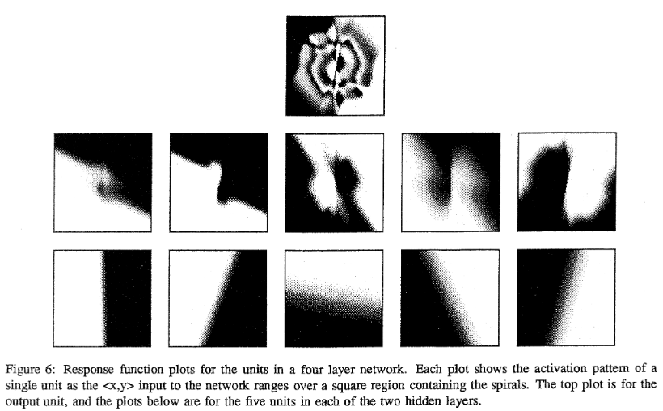

[Lang, K.J. and Witbrock, M.J., 1988, June. Learning to tell two spirals apart. In Proceedings of the 1988 connectionist models summer school (No. 1989, pp. 52-59).](https://www.gwern.net/docs/ai/1988-lang.pdf)

---

👁️👁️👁️

Solve the simple neural network task of classifying points belonging to two spirals: introduces residual connections to deal with the vanishing gradient problem.

**Problem:**

Vanishing gradients: mentions that learning is slowed down by approximately an order of magnitude for each layer added to the network, presumably because weights have been initialised between -0.1 and  0.1, hence the figure of 1 order of magnitude. Also, mentions that this causes learning to slow down specifically because of the slow learning of neurons in the early layers. 

**Solution:**

Introduce residual connections (they call them short-cut connections) to fix the issue of vanishing gradients. Each layer in the network is connected to all succeding layers.

**Architecture:**

Use a network with 19 units and 138 connections, trained for 20k epochs of vanilla backprop (and 10k epochs using Binary Cross Entropy loss instead of MSE). 2 input neurons (x, y coord), one output neuron for classification. 
Interesting mention of a rule of thumb for choosing network capacity: mentions that their research group uses the rule of thumb that each connection weight can learn 1.5 bits of information. Training set is 194 points, classification is binary, so the task requires the network to be able to process 194 bits of information, which gives 194/1.5 = 130 weights. The network then has 3 hidden layers and 5 units per layer, giving 138 weights.

**Results:**
Some interesting and simple visualisations of the inner working of the network: units in the first hidden layer learn a linear separation of the inputs at different anglees, while units in the second hidden layer learn rotating patterns of different sizes that are to be combined to form a spiral in the output layer.

Also compares the visualisation of the output prediction at four checkpoints between two runs of the network, and discusses why one run might be preferable to the other, by visually inspecting the output classification surface, in addition to looking at number of classification errors. 

Compares MSE with Binary Cross Entropy (just called Cross Entropy in the paper), BCE performs better. Also compares with a version of backpropagation called QuickProp, which obtains the best results. However all runs somehow learn the highly nonlinear spiral function.

**Notes**

AFAIK first appearance of residual connections in the literature: successfully trains a network with several hidden layers.

Trivia: the code was written in C

---

[BACK](../index.md)

[HOME](../../../index.md)