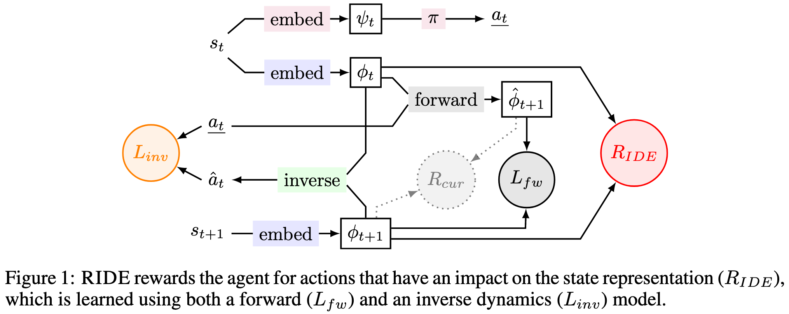

[Raileanu, R. and Rocktäschel, T., 2020. RIDE: Rewarding Impact-Driven Exploration for Procedurally-Generated Environments. arXiv preprint arXiv:2002.12292.](https://arxiv.org/pdf/2002.12292.pdf)

**Problem:** Existing methods adding intrinsic rewards to encourage exploration fail in environments where states are not likely to be experienced twice, such as in procedurally generated ones. 

**Solution:** A new type of intrinsic reward is introduced, that rewards the actor for actions that lead to a change in its learned state representation

**Results:** 
1) More sample efficient exploration, especially on a procedurally generated MiniGrid environments. 
2) The intrinsic reward does not diminish in the course of training
3) **Reward is higher when agent interacts with objects that it can control**
4) This intrinsic reward is robust to the noisy TV problem (adding curiosity-driven intrinsic reward like the one by [Pathak et al. 2017](../pathak_et_al_2017/summary.md) results in an agent being attracted by states with high entropy, e.g. get stuck watching white noise on a TV, because the agent is rewarded for errors in its prediction)

**Architecture:**

 

A state representation $\phi(S)$ is learned with the same forward-backward prediction method of [Pathak et al. 2017](../pathak_et_al_2017/summary.md), but while curiosity-driven intrinsic reward was defined as the euclidean distance between the predicted state representation and the actual state representation, impact-driven intrinsic reward RIDE is defined as the euclidean distance between two consecutive state representation, with no reference to the actual observed state.

$$ R_{IDE}(S_{t},A_{t})=r_{t}^{i}(s_{t}, a_{t})=\frac{||\phi(s_{t+1}) - \phi(s_{t})||_{2}}{\sqrt{N_{ep}(s_{t+1})}}$$

---

[HOME](../../../README.md)